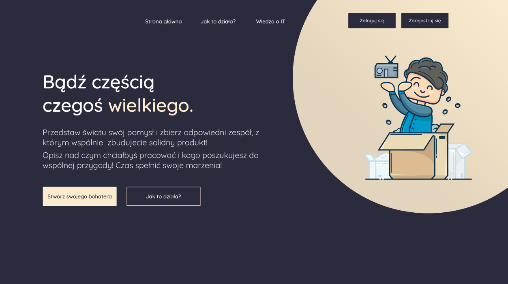

# :hammer_and_wrench: Zaadoptuj programistę

## Table of contents
* [General info](#general-info)
* [Technologies](#technologies)
* [Usage](#usage)
* [Setup](#setup)
* [Live preview](#live-preview)

## General info
Project is being created by the group of three developers. This project is a web application which allows us to register a new user. Each user can create their own projects, describe them in detail, specify team members they are looking for or search for existing project created by someone else and apply.





## Technologies
Project is created with:
* React (styled components, hooks, react context, react router, react select, react responsive)
* JavaScript
* Firebase (Firestore, Authenticaton)
* HTML
* Figma (design)

	
## Features
* Creating new user
* Searching for projects
* Creating new projects/adding to the main Firebase Firestore database.
* Applying to a project
* Notification system

## To do
* Messages
* Finalize procedures of applying to a project
* Implement Firebase Storage (user profile images)
* Notification system
* Friends system
* Editing user profile
* Fix bugs/RWD

## Setup
Clone this repo and run ``` $ npm install ``` to install all dependecies.

## Usage 
Once the dependencies are installed, you can run ```$ npm start ```  to start the application.

## Live preview
You can also click here https://infoshareacademy.github.io/jfddr1-maklowiczeprogramowania-app/ to live preview.


